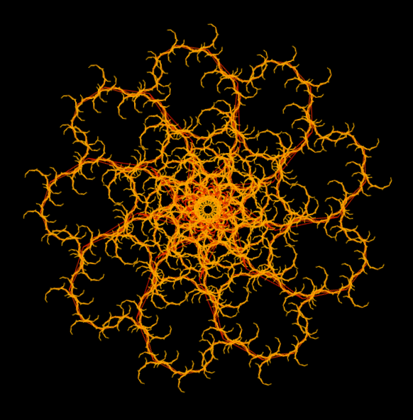
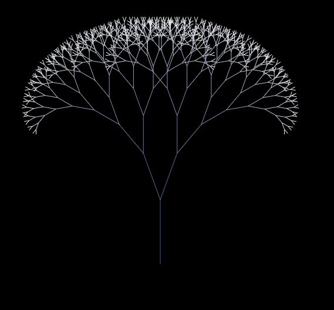
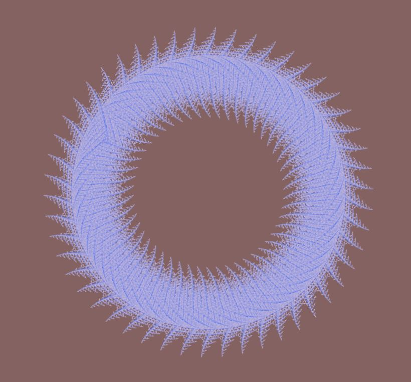

# JavaScript L-System Dual Canvas Fractal Demo

Straight forward dual canvas technique showing how to utilize a single iterative function to draw L-system fractals with replications.

No license here - don't care - do what'cha want with it. No credit or anything required.
